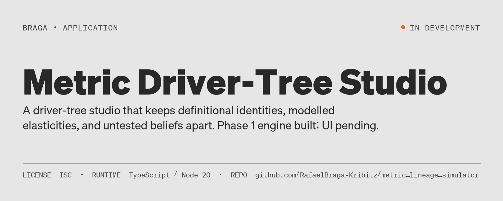
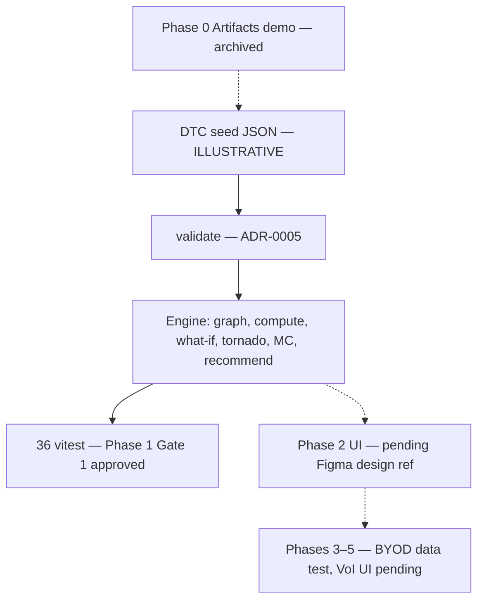

# Metric Driver-Tree Studio



[](https://github.com/RafaelBraga-Kribitz/metric_lineage_simulator/actions/workflows/governance.yml)
[](LICENSE)
[](#status)

**Status:** In development

**Runtime:** TypeScript / Node 20
**Codename:** `metric_lineage_simulator`

Metric tools blur definitional identities, declared elasticities, and untested beliefs, which produces false precision and casual causal language. This project is a driver-tree studio that keeps those three kinds of claim separate and ranks which guesses are worth testing — a thinking aid for metric design, not an econometric oracle.



## Project status

**Phase 1 complete (36 vitest); Review Gate 1 approved** 2026-06-07. The TypeScript engine, schema, formula parser, Monte Carlo, and DTC seed live in `driver_tree_studio/` and match [ADR-0006](governance/adrs/0006-engine-and-formula.md) / [ADR-0007](governance/adrs/0007-phase-1-implementation.md).

Phase 2 UI (Next.js + React Flow + funnel + verbal builder) is **pending** a Figma design ref ([ADR-0008](governance/adrs/0008-phases-2-through-5.md)). Phases 3–5 (BYOD data test, share URLs, Guesstimate / value-of-information UI) are also pending. There are **no results yet** to quote: DTC seed numbers are illustrative until a defended authoring pass; a public BRAGA-branded launch is gated at Phase 4.

Phase 0 is archived (`archive/phase-0/`; runnable via `demo/`). It is not product SSOT.

## See it running

No hosted live demo. Phase 2 is the interactive product surface; it is not the current gate.

The archived Phase 0 Artifacts prototype can be opened locally:

```bash
cd demo && npm install && npm run dev
```

That shell loads `archive/phase-0/driver-tree-studio.tsx`. Logic extracted from it now lives in `driver_tree_studio/` ([ADR-0007](governance/adrs/0007-phase-1-implementation.md)). Intended user workflow (not yet a shipped UI) is the experimentation flywheel in [ADR-0004](governance/adrs/0004-product-model-and-positioning.md): topology → guesstimate → propagate (value of information) → prioritize → test → update.

## Explore this project

| Audience | Start here |
|---|---|
| Fast path | [Project status](#project-status) and the three edge kinds below |
| Deep path | [ADR-0004](governance/adrs/0004-product-model-and-positioning.md) (product model) → [ADR-0005](governance/adrs/0005-schema-and-validation.md) / [ADR-0006](governance/adrs/0006-engine-and-formula.md) (schema + engine) → `cd driver_tree_studio && npm test` |

## Method

Input is a `BusinessModel` (nodes, edges, north star, narrative). Transformation is typed validation, then a deterministic engine. Output is recomputed values, what-if / tornado deltas, Monte Carlo percentiles, and a Phase 1 recommender — not a causal claim.

Three edge kinds ([ADR-0004](governance/adrs/0004-product-model-and-positioning.md)):

| Kind | What is known | In compute |
|---|---|---|
| `identity` | Locked definitional formula | Yes |
| `modeled` | Mechanism + elasticity (point or distribution) + functional form | Yes, flagged |
| `hypothesized` | Direction + rationale only | No (topology) |

Guesstimate is not a fourth kind: it is `modeled` with `elasticity_distribution`. Computation flows child → parent. Observational findings are never labeled causal; “causal” is reserved for a backing method.

```text
1. TOPOLOGY      hypothesized edge: A may affect B, no number
2. GUESSTIMATE   modeled edge: elasticity distribution + functional form
3. PROPAGATE     does uncertainty move the north star? (value of information)
4. PRIORITIZE    rank tests by impact × uncertainty / test cost
5. TEST          estimate from the user's data
6. UPDATE        promote the edge, narrow the distribution → back to 3
```

Steps 2–3 decide what to test. Step 5 yields association unless an experiment backs causation. VoI / Guesstimate UI is Phase 5, not Phase 1.

## Data

The committed seed `driver_tree_studio/src/content/dtc_ecommerce.json` is an **ILLUSTRATIVE** direct-to-consumer ecommerce tree. North star is contribution profit (baseline 48,000 in the seed), not revenue. Identity identities in the seed:

- `contribution_profit = net_revenue - variable_costs`
- `net_revenue = orders × average_order_value`
- `variable_costs = orders × cost_per_order`
- `orders = sessions × conversion_rate`
- `sessions = new_sessions + returning_sessions`

One modeled edge (`email_capture_rate → returning_sessions`, linear, elasticity 0.3) is tagged illustrative. Two hypothesized edges (`page_load_speed → conversion_rate`; `loyalty_membership → customer_ltv` with a selection-trap warning) carry evidence grade `none`. Austrian preset labels are illustrative labels only, never copies of real internal metrics ([ADR-0004](governance/adrs/0004-product-model-and-positioning.md)).

No `VERIFIED` client warehouse feed is in this repository. Seed numbers stay illustrative until the Phase 4 authoring pass.

## Validation

How this is kept from producing plausible-looking numbers:

| Gate | What it checks |
|---|---|
| `validate()` ([ADR-0005](governance/adrs/0005-schema-and-validation.md)) | Edge refs, DAG, north star, controllable leaves, per-kind fields, double-count, identity reconciliation (`rel error < 1e-6`) |
| Phase 1 vitest matrix ([ADR-0007](governance/adrs/0007-phase-1-implementation.md)) | Schema fail-per-rule, formula parser, topo/cycles, identity recompute, four functional forms, what-if, tornado, Monte Carlo p10<p50<p90, hypothesized edges in `untestedBeliefs` |
| `cd driver_tree_studio && npx vitest run` | **36 tests** — Review Gate 1 input |
| `make verify` | Governance adversary + debt ratchet ([ADR-0009](governance/adrs/0009-tech-debt-ratchet.md)) |

Monte Carlo is seeded. Modeled effects are assumed multiplicative and independent; that assumption is part of the methodology, not hidden.

## Architecture

Hero diagram above. Implemented Phase 1 package ([ADR-0007](governance/adrs/0007-phase-1-implementation.md)):

```text
driver_tree_studio/
  src/schema/     types.ts, validate.ts
  src/engine/     graph, compute, whatif, sensitivity, montecarlo, recommend
  src/lib/        formula parser, rng
  src/content/    dtc_ecommerce.json
  tests/          schema, engine, lib, content
```

`recommend.ts` uses a Phase 1 simplification: tornado top levers, below-baseline guardrails, all hypothesized edges as untested beliefs. Future modules (`estimate.ts`, `valueOfInformation.ts`, `prioritize.ts`, Monte Carlo worker, canvas) are specified in [ADR-0008](governance/adrs/0008-phases-2-through-5.md) and are not the Gate 1 deliverable.

## Reproduce

```bash
git clone https://github.com/RafaelBraga-Kribitz/metric_lineage_simulator.git
cd metric_lineage_simulator

# Phase 1 engine (Gate 1)
cd driver_tree_studio
npm ci
npx vitest run          # 36 tests
npm run typecheck       # optional

# Governance + closed-finding adversary
cd ..
make verify

# Archived Phase 0 demo (throwaway UI)
cd demo && npm install && npm run dev
```

Node 20 is what CI uses (`.github/workflows/governance.yml`). Every session on this repo starts with `make session-start` and `governance/SESSION_HANDOUT.md` ([CLAUDE.md](CLAUDE.md)).

## Limitations

- No production UI before the Figma design ref; no VoI / Guesstimate UI before Phase 5.
- Illustrative DTC numbers until a defended authoring pass. Do not treat seed elasticities as measured effects.
- Phase 0 TSX at `archive/phase-0/` is not product SSOT.
- `recommend.ts` guardrails are a simplified below-baseline check (Phase 1).
- Path A is single-player: no crowdsourcing or community backend.
- Observational data tests (Phase 3) will not be allowed to say “causes.”
- Public name-on-portfolio launch is blocked until illustrative-only edges are replaced ([ADR-0004](governance/adrs/0004-product-model-and-positioning.md) launch gate).

Falsification: if identity parents fail reconciliation at `1e-6`, or if copy calls an observational / hypothesized edge causal, the current contract is broken.

## Repository structure

```text
PROJECT_CHARTER.md          Executive SSOT (≤200 lines)
governance/adrs/            Normative ADRs 0003–0009
governance/findings/        Audit work queue
driver_tree_studio/         Phase 1 TS core + tests
demo/                       Vite shell for the Phase 0 artifact
archive/phase-0/            Throwaway Claude Artifacts prototype
scripts/, tests/governance/ Debt ratchet and finding verification
```

## Status

**Status:** In development

Last validated: 2026-06-07 (Review Gate 1 approved; Phase 1 complete (36 vitest)). Charter metadata `status: active`. Phase 2–5 remain pending in [charter §4](PROJECT_CHARTER.md).

## License

ISC, as declared in `driver_tree_studio/package.json`. See [`LICENSE`](LICENSE).

## Author

<table>
  <tr>
    <td width="110">
      
    </td>
    <td>
      <strong>Rafael Braga-Kribitz</strong><br />
      Seiersberg-Pirka, Austria · Portfolio project, 2026<br />
      <a href="https://www.linkedin.com/in/rafaelbragakribitz/">LinkedIn</a>
      ·
      <a href="mailto:rafaelbragakribitz@gmail.com">rafaelbragakribitz@gmail.com</a>
    </td>
  </tr>
</table>
